📘 Sosyal Ağ Analizi Uygulaması – Proje II
1. Proje Bilgileri

Proje Adı: Sosyal Ağ Analizi Uygulaması

Ekip Üyeleri:

Sertaç Özdemir

Tarih: 2025

2. Giriş (Problem Tanımı ve Amaç)

Günümüzde sosyal ağlar, kullanıcılar arasındaki etkileşimlerin analiz edilmesi
açısından önemli veri kaynaklarıdır. Bu projede, kullanıcılar ve aralarındaki
bağlantılar grafik (graph) veri yapısı kullanılarak modellenmiştir.

Projenin amacı; grafik veri yapıları, grafik algoritmaları, nesne yönelimli
tasarım ve görselleştirme konularının uygulamalı olarak öğrenilmesidir.

3. Kullanılan Algoritmalar
3.1 Genişlik Öncelikli Arama (BFS)

Çalışma Mantığı:
BFS algoritması, başlangıç düğümünden başlayarak grafı katman katman
dolaşır. Önce en yakın komşular, sonra onların komşuları ziyaret edilir.

Akış Diyagramı:

### BFS (Breadth-First Search)

```mermaid

flowchart TD
    A[Başlangıç Node] --> B[Kuyruğa ekle]
    B --> C[Kuyruktan node çıkar]
    C --> D{Ziyaret edildi mi?}
    D -->|Hayır| E[Node'u ziyaret et]
    E --> F[Komşuları kuyruğa ekle]
    F --> C
    D -->|Evet| C
```

### DFS (Depth-First Search)

```mermaid
flowchart TD
    A[Başlangıç Node] --> B[Node'u ziyaret et]
    B --> C[Bir komşuya git]
    C --> D{Ziyaret edilmemiş komşu var mı?}
    D -->|Evet| B
    D -->|Hayır| E[Geri dön]
```

---

# 🟥 Dijkstra – Mermaid Akış Diyagramı

### Dijkstra Algoritması

```mermaid

flowchart TD
    A[Başlangıç Node] --> B[Mesafeleri başlat]
    B --> C[En kısa mesafeli node'u seç]
    C --> D[Komşuları güncelle]
    D --> E{Güncellenecek node var mı?}
    E -->|Evet| C
    E -->|Hayır| F[Bitiş]
```

---

# 🟨 A* – Mermaid Akış Diyagramı
### A* Algoritması

```mermaid
flowchart TD
    A[Başlangıç Node] --> B[f = g + h hesapla]
    B --> C[En küçük f değerli node'u seç]
    C --> D[Komşuları güncelle]
    D --> E{Hedefe ulaşıldı mı?}
    E -->|Evet| F[Bitiş]
    E -->|Hayır| C
```

---

# 🟪 Welsh–Powell – Mermaid Akış Diyagramı

### Welsh–Powell Graf Renklendirme

```mermaid
flowchart TD
    A[Node'ları dereceye göre sırala]
    A --> B[ node'u renklendir]
    B --> C{Komşu aynı renkte mi?}
    C -->|Hayır| B
    C -->|Evet| D[Sonraki node'a geç]
    D --> C
```

3.1 Breadth First Search(BFS)

Zaman Karmaşıklığı:

O(V + E)

Bellek Karmaşıklığı:

O(V)
Kuyruk ve ziyaret edilen düğümler için ek bellek kullanılır.

Literatür İncelemesi:
BFS, grafiklerde erişilebilirlik ve en kısa yol (ağırlıksız) problemlerinde
yaygın olarak kullanılmaktadır.

3.2 Derinlik Öncelikli Arama (DFS)

Çalışma Mantığı:
DFS algoritması, bir düğümden başlayarak mümkün olduğu kadar derine iner,
sonra geri dönerek diğer dalları ziyaret eder.

Zaman Karmaşıklığı:

O(V + E)

Bellek Karmaşıklığı:

O(V)
Özyineleme (recursive) veya stack yapısı kullanımı nedeniyle bellek tüketimi oluşur

Literatür:
DFS, bağlı bileşenlerin bulunması, döngü tespiti ve topolojik sıralama gibi
problemlerde sıklıkla tercih edilmektedir

3.3 Dijkstra Algoritması

Çalışma Mantığı:
Ağırlıklı grafiklerde en kısa yolu bulmak için kullanılır. Her adımda
en düşük maliyetli düğüm seçilir.

Zaman Karmaşıklığı:

O(E log V)

3.4 A* Algoritması

Çalışma Mantığı:
Dijkstra algoritmasına sezgisel (heuristic) bir fonksiyon eklenerek
daha hızlı sonuç alınması hedeflenir.

3.5 Welsh–Powell Graf Renklendirme

Çalışma Mantığı:
Komşu düğümlerin aynı renge sahip olmamasını sağlayacak şekilde
graf renklendirilir.

4. Sınıf Yapısı ve Modüller
4.1 Sınıf Diyagramı
classDiagram
    class Node {
        id
        aktiflik
        etkilesim
        neighbors
    }

    class Edge {
        a
        b
        weight
    }

    class Graph {
        nodes
        edges
        add_node()
        add_undirected_edge()
        get_edge_weight()
    }

    class MainWindow
    class GraphView

    Graph "1" o-- "*" Node
    Graph "1" o-- "*" Edge
    MainWindow --> Graph
    MainWindow --> GraphView

5. Uygulama Ekranları ve Test Senaryoları
EN ETKİLİ 5 KULLANICI

Kullanıcı ekleme / silme

Bağlantı ekleme / silme

Algoritma çalıştırma

DFS Algoritma çalıştırma

Performans testi

6. Performans Testleri
Düğüm Sayısı	Edge Sayısı	BFS (s)	DFS (s)	Dijkstra (s)
15	5	0.000008	0.000003	0.000011
75	219	0.000034	0.000065	0.000427
7. Sonuç ve Tartışma

Bu proje kapsamında sosyal ağ analizi için grafik veri yapıları ve
algoritmalar başarılı bir şekilde uygulanmıştır.

Başarılar:

Tüm temel grafik algoritmaları uygulanmıştır

Görsel ve etkileşimli arayüz geliştirilmiştir

Sınırlılıklar:

Çok büyük grafiklerde performans sınırlıdır

Olası Geliştirmeler:

Daha gelişmiş merkezilik ölçümleri

Büyük veri kümeleri için optimizasyon
